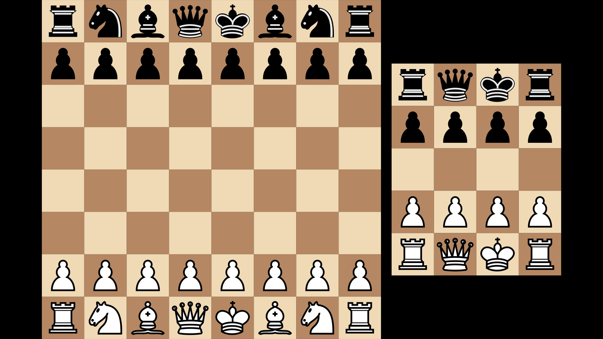

# Generate chess-boards with positions for [Manim](https://github.com/ManimCommunity/manim)
Can be used to create a Manim-object of a chess-position given a FEN-string. Also works for boards of non-standard sizes, up to 9x9.
Uses the [cburnett piece-set](https://github.com/lichess-org/lila/tree/master/public/piece/cburnett) from Lichess.
## Installation
A quick and easy way to get the code set up is to run
```bash
git submodule add https://github.com/patrik-ha/manim-chess.git manim_chess
```
in your working directory. This also makes sure that the cloned folder has a name that is importable by python. (`import manim-chess` anyone?)
## Usage
```python
# From examples/basic_example.py
from manim import *
from manim_chess.chess_board import ChessBoard

class Chess(Scene):
    def construct(self):
        board = ChessBoard("rnbqkbnr/pppppppp/8/8/8/8/PPPPPPPP/RNBQKBNR w KQkq - 0 1")
        small_board = ChessBoard("rqkr/pppp/4/PPPP/RQKR w - - 0 1").next_to(board, RIGHT)
        self.add(Group(board, small_board).center())
```
Then, run in command-prompt (given a valid install of Manim)
```bash
manim -pqh example.py
```


Other examples can be found in [/examples](/examples).
